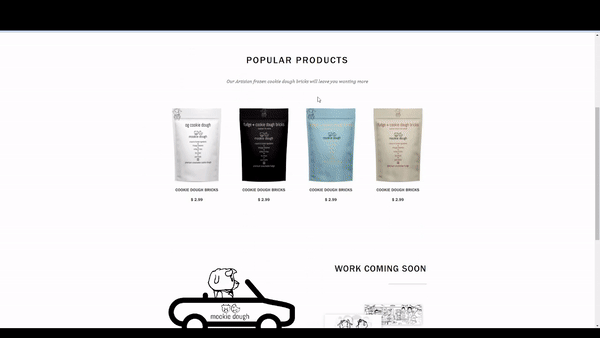
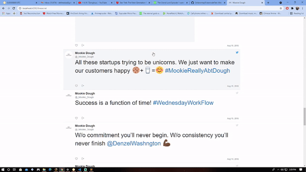

# MEAN stack Web Application for Mookie Dough LLC, a culinary startup Co-Founded by 4 African-American Stanford University students under Stanford University's Cardinal Ventures incubator program.

 

Important Folder Structure\

Alamode\
├── public\
│   └── A6Frontend\
│       └──  src  -- Contains Angular frontend code including HTML and TypeScript\
│            └──  app -- Contains Angular content: TypeScript\
├── app -- Backend code\
│   ├── models -- Contains numerous MongoDB models that are used to populate and upate the database\
│   ├── passport\
|        └──  passport.js -- Api file containing services for social media and email login\
│   ├── routes\
|        └──  api.js -- Api file containing full RESTful api for ecommerce application\

To attempt to run the application after cloning the repo with NodeJS installed:\

npm install -g @angular/cli\
npm install -g @angular-devkit/build-angular\
Open terminal in folder Alamode/public\
run command "npm install"\
Open terminal in folder Alamode/public/A6Frontend\
run command "npm install"\

After installation one should be able to run the command "ng serve" in Alamode/public/A6Frontend to view the web application at http://localhost:4200/home. 

